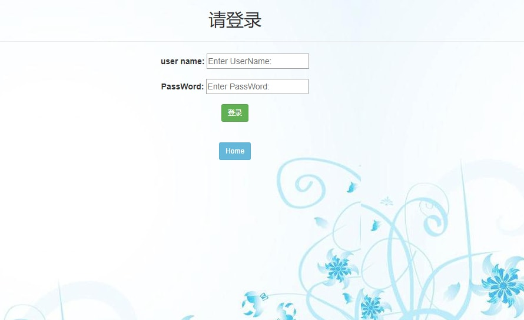
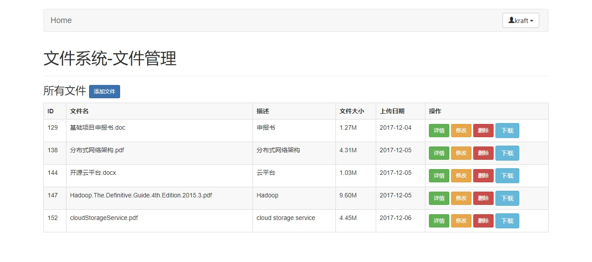

###云安全存储

##简介：
    将上传的文件切片，加密分布在多个云上存储，下载后再解密校验，聚合为整个文件，保证文件的多备份安全存储。

###使用技术

        IOC容器：Spring

        Web框架：SpringMVC

        ORM框架：hibernate

        安全框架：Shiro

        数据源：C3P0

        日志：log4j

        前端框架：Bootstrap

* 运行环境和所需工具

    编译器：IntelliJ IDEA
    
    项目构建工具：Maven
    
    数据库：Mysql
    
    JDK版本：jdk1.8
    
    Tomcat版本：Tomcat9.x

* 初始化项目

    登录账户
    
    账户1：vellerzheng
    
    账户2：Kraft
    
    密码均为：123456

###功能模块介绍

       1.登陆模块
       

       
       2.文件管理模块
       

       
       

